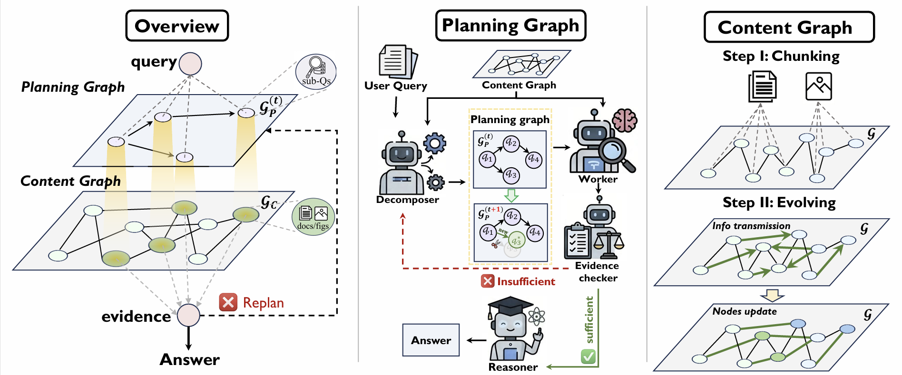

# 💻 $G^2$‑Reader: Dynamic DAG‑based Document Reader for Multi‑modal Long‑Document Understanding

[](#)
[](#)
[](LICENSE)
=======

> 🎯 **$G^2$‑Reader** is a dual-graph RAG framework designed for complex multimodal document QA. It overcomes "semantic fragmentation" by utilizing a Content Graph ($\mathcal{G}_C$) that preserves document-native layouts and cross-modal alignments through iterative VLM-based message passing. Simultaneously, it employs a Planning Graph ($\mathcal{G}_P$), an agentic DAG that decomposes queries into sub-questions and dynamically refines reasoning paths based on evidence sufficiency. 



---

## ✨ Highlights
* 🏗️ **Dual-Graph Synergy** – Integrates a Content Graph ($\mathcal{G}_C$) for structured evidence representation with a Planning Graph ($\mathcal{G}_P$) for agentic reasoning control.
* 🧬 **Content Graph Evolution** – Unlike static chunking, $\mathcal{G}_C$ preserves document layouts and cross-modal links through iterative joint evolution, where VLM-based message passing enriches node attributes and induces semantic edges.
* 🧠 **Planning Graph Evolution** – $\mathcal{G}_P$ maintains an agentic DAG of sub-questions that dynamically refines its structure based on evidence sufficiency, allowing the system to bridge information gaps through iterative replanning.
  
---

## 🚀 Getting Started

### 1. 🛠️ Installation

```bash
# Create environment
conda create -n G2-reader python=3.10
conda activate G2-reader

# Clone repository
git clone https://github.com/justLittleWhite/G2-Reader.git
cd G2-Reader

# Install dependencies
pip install -r requirements.txt
```

### 2. ⚙️ Configuration

Set up your LLM API and base paths in `config/config.py`:

```python
LLM_BASE_URL = "https://api.openai.com/v1"
LLM_API_KEY = "your-api-key"

# Data root directory
DATA_ROOT = "/path/to/your/data"
```

## 📁 Project Structure

```text
G2-Reader/
├── agent_search/      # Core Logic: DAG decomposition, reasoners, and execution engine
├── prebuild/          # Preprocessing: Documents parsing  and Content Graph construction
├── config/            # Configuration: Model parameters and Prompt templates
├── scripts/           # Execution: End-to-end inference and accuracy evaluation
├── data/              # Dataset: Supports five multimodal domains from VisDoMBench
└── utils/             # Helpers: Function for Graph operations
```

---

### 3. ⏱️ Quick Inference

You can run full evaluations or single inference tasks using the provided scripts.

**Run inference:**
```bash
bash scripts/G2reader.sh
```

**Run evaluation:**
```bash
python scripts/evaluate.py
```

---

## 📢 News
* [2026-01-28] 🎉 Project cleanup completed and code successfully uploaded to GitHub.
* [2026-01-xx] 📄 D2-Reader paper submitted.

---

## ✍️ Citation

If you find D2-Reader useful for your research, please cite:

```bibtex
@article{zhou2026d2reader,
  title={D2-Reader: Dynamic DAG-based Document Reader for Multi-modal Long-Document Understanding},
  author={Yifan Zhou and et al.},
  journal={arXiv preprint arXiv:25xx.xxxxx},
  year={2026}
}
```

---

## 📝 License

This project is licensed under the **Apache 2.0** License - see the [LICENSE](LICENSE) file for details.

## 🙏 Acknowledgements
We thank **MinerU** for providing high-quality PDF parsing capabilities, and the open-source community for the foundational models (OpenAI/Qwen) that power this project.
